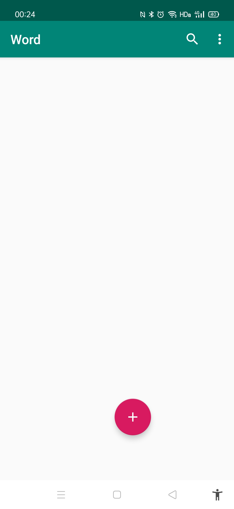
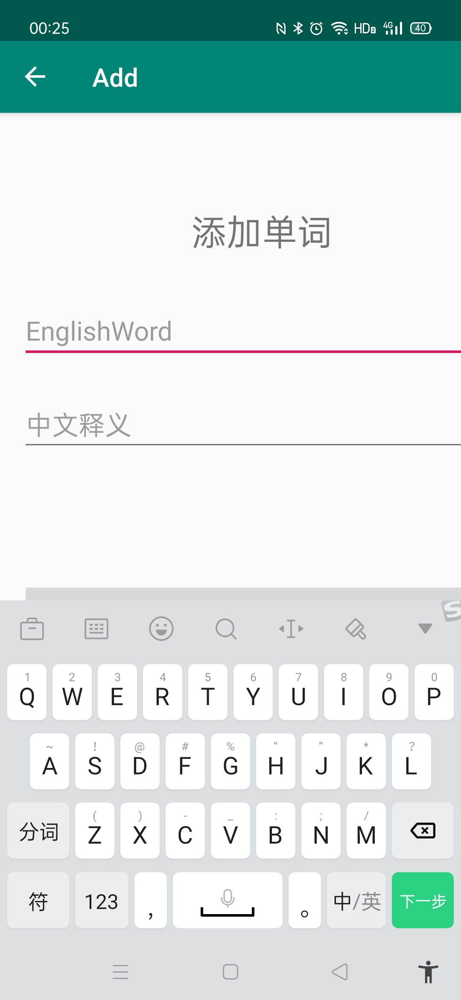
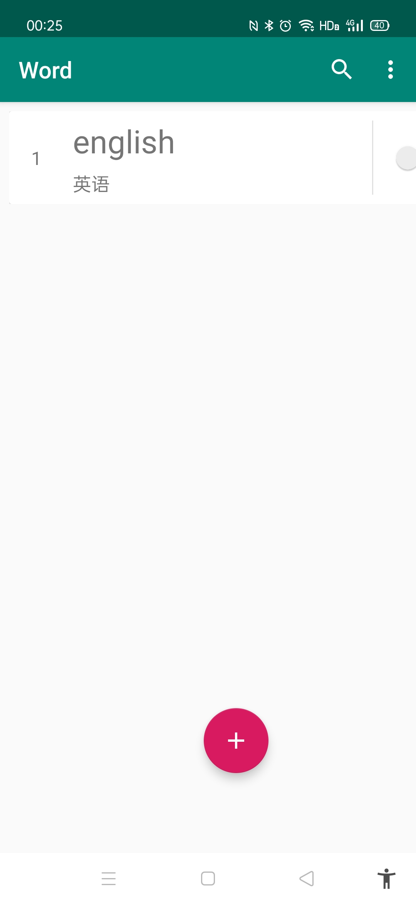
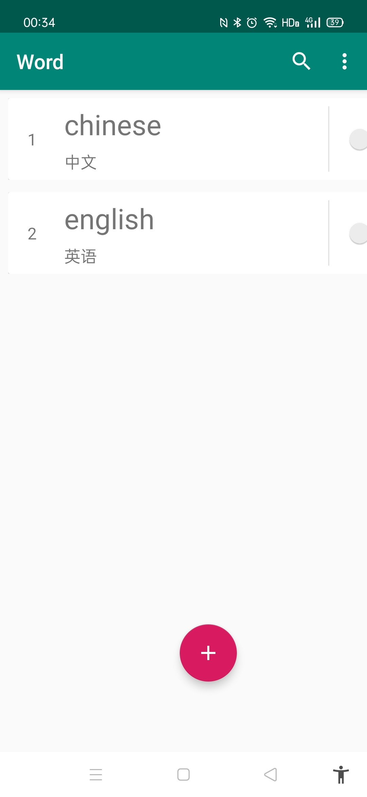

summary: 测试，第一个codelab
id: first_codelab
categories: Android
tags: android
status: Published 
authors: kk
Feedback Link: https://github.com/wkk-knight/

<!-- 标题  用一级-->
# 第一个codelab 

<!------------------- 步骤1 步骤用二级标签 --------------->

## 源码下载
<!-- 这一步估计需要的时间-->
Duration: 1 
<!-- 第一步的内容 start  -->

### 下载链接：
[yanghui2478/IMD (github.com)]

<!-- 第一步的内容 end  -->

<!-------------------- 步骤 2------------------------>
## 开发环境配置
Duration: 2
<!-- 第二步的内容 start  -->
在Android Studio中完成代码的编写。

其中，用户输入要记忆的单词，系统会自动保存到sqllte数据库。

<!-- 第二步的内容 end  -->

<!-------------------- 步骤 3------------------------>

## 运行环境配置

Duration: 3
<!-- 第三步的内容 start  -->

Andoid手机下载APK都可以顺利使用。

<!-- 第三步的内容 end  -->

<!-------------------- 步骤 4------------------------>

## 运行效果展示

Duration: 4
<!-- 第四步的内容 start  -->

初始界面。

点击加号添加单词，进入下一个界面。

保存后会在初始界面显示

加入复数个单词可以自由切换位置

点击右侧开关选择是否显示释义

<!-- 第四步的内容 end  -->

<!-------------------- 步骤 3------------------------>

## 结束

